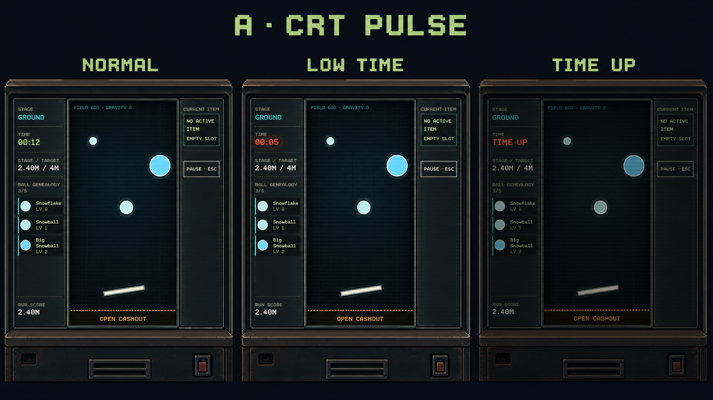

# Approved FX Mockups

## Time CRT Pulse v1

- 적용 범위: `ST-02 시간 부족 경고`, `ST-03 Time Up Lock`
- 승인 방향: `A · CRT PULSE`
- 상태 순서: `NORMAL → LOW TIME → TIME UP`
- 제외: frame alarm, corner lock, rail signal, Settlement, Stage Clear, Stage Failure
- 용도: Time CRT의 상태 변화와 강도 기준. 목업의 HUD 배치나 표시 정보는 런타임 UI 계약이 아니다.

